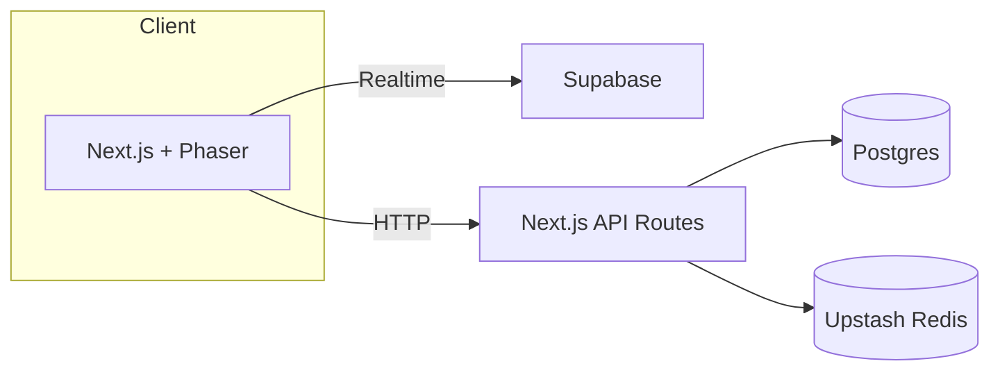

# PhotonPong

Modern Pong built with Next.js, Phaser 3, and a serverless stack.

## Setup

```bash
pnpm install
pnpm prisma migrate dev
pnpm dev
```

Copy `.env.example` to `.env.local` and fill in secrets.

## Architecture Overview



## Internationalization

This project uses [`react-i18next`](https://react.i18next.com/) for translations.
Locale files live in `src/locales`.

To add a new language:

1. Create `src/locales/<code>.json` with your translations.
2. Import the file and add it to the resources in `src/i18n.ts`.
3. Update the `<LanguageSwitcher />` component with the new option.

## Troubleshooting

- Ensure Postgres database is reachable via `DATABASE_URL`.
- Run `pnpm prisma migrate dev` after changing the schema.
- If Playwright tests fail, install browsers with `npx playwright install`.
