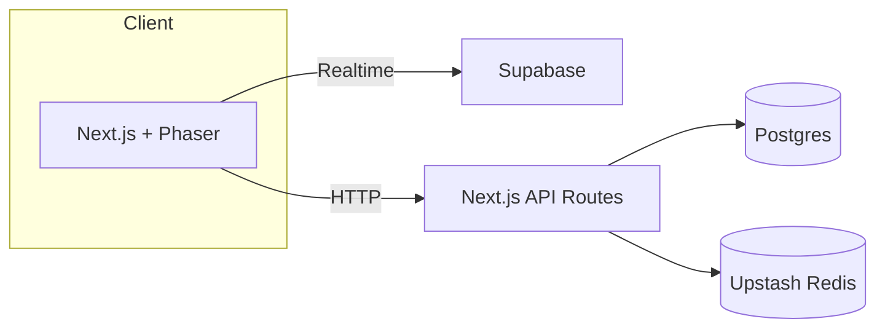

# PhotonPong

Modern Pong built with Next.js, Phaser 3, and a serverless stack.

## Setup

```bash
pnpm install
pnpm prisma migrate dev
pnpm dev
```

Copy `.env.example` to `.env.local` and fill in secrets.

### Environment variables

Set the following environment variables for the application:

- `DATABASE_URL` – Postgres connection string
- `NEXTAUTH_URL` – Base URL for NextAuth callbacks
- `EMAIL_SERVER` – SMTP server connection string
- `EMAIL_FROM` – Sender email address
- `GITHUB_ID` – GitHub OAuth client ID
- `GITHUB_SECRET` – GitHub OAuth client secret
- `AUTH_SECRET` – NextAuth secret
- `UPSTASH_REDIS_URL` – Upstash Redis REST URL
- `UPSTASH_REDIS_TOKEN` – Upstash Redis REST token

Optional variables:

- `NEXT_PUBLIC_POSTHOG_KEY` – PostHog client key
- `NEXT_PUBLIC_POSTHOG_HOST` – PostHog host URL

Use these names when setting deployment secrets.

## Architecture Overview



## Offline Testing

To verify the service worker's offline cache:

1. Run `pnpm dev` and open the app in your browser.
2. In DevTools, confirm the service worker is registered under **Application → Service Workers**.
3. Switch the Network panel to **Offline** and reload the page.
4. The app should load using cached assets even without a network connection.

## Troubleshooting

- Ensure Postgres database is reachable via `DATABASE_URL`.
- Run `pnpm prisma migrate dev` after changing the schema.
- If Playwright tests fail, install browsers with `npx playwright install`.
