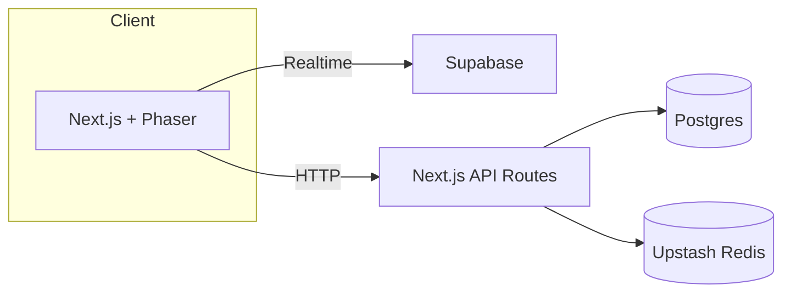

# PhotonPong

Modern Pong built with Next.js, Phaser 3, and a serverless stack.

## Setup

```bash
pnpm install
pnpm prisma migrate dev
pnpm dev
```

Copy `.env.example` to `.env.local` and fill in secrets.

## Environment Variables

The application requires the following variables:

- `DATABASE_URL` – Postgres connection string.
- `EMAIL_SERVER` – SMTP connection string.
- `EMAIL_FROM` – Sender email address.
- `GITHUB_ID` – GitHub OAuth client ID.
- `GITHUB_SECRET` – GitHub OAuth client secret.
- `GOOGLE_ID` – Google OAuth client ID.
- `GOOGLE_SECRET` – Google OAuth client secret.
- `AUTH_SECRET` – Secret used by NextAuth.
- `UPSTASH_REDIS_URL` – Upstash REST URL.
- `UPSTASH_REDIS_TOKEN` – Upstash REST token.
- `SUPABASE_URL` – Supabase project URL.
- `SUPABASE_KEY` – Supabase service role key.
- `NEXTAUTH_URL` – Base URL for NextAuth callbacks.
- `NEXT_PUBLIC_POSTHOG_KEY` – (optional) PostHog API key.
- `NEXT_PUBLIC_POSTHOG_HOST` – (optional) PostHog API host.

## Architecture Overview



## Troubleshooting

- Ensure Postgres database is reachable via `DATABASE_URL`.
- Run `pnpm prisma migrate dev` after changing the schema.
- If Playwright tests fail, install browsers with `npx playwright install`.
