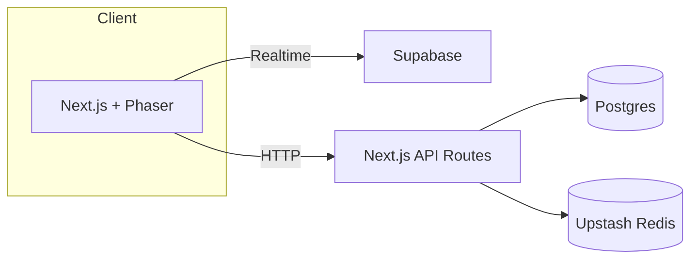

# PhotonPong

Modern Pong built with Next.js, Phaser 3, and a serverless stack.

## Setup

```bash
pnpm install
pnpm prisma migrate dev
pnpm dev
```

Copy `.env.example` to `.env.local` and fill in secrets.

### Environment variables

The application uses the following environment variables:

- `DATABASE_URL` – Postgres connection string
- `AUTH_SECRET` – secret used by NextAuth
- `EMAIL_SERVER` – SMTP connection string
- `EMAIL_FROM` – address to send emails from
- `GITHUB_ID` – GitHub OAuth app ID
- `GITHUB_SECRET` – GitHub OAuth app secret
- `GOOGLE_ID` – Google OAuth client ID
- `GOOGLE_SECRET` – Google OAuth client secret
- `UPSTASH_REDIS_URL` – Upstash Redis REST URL
- `UPSTASH_REDIS_TOKEN` – Upstash Redis REST token
- `NEXT_PUBLIC_POSTHOG_KEY` – optional, PostHog project key
- `NEXT_PUBLIC_POSTHOG_HOST` – optional, PostHog host URL
- `SUPABASE_URL` – Supabase project URL
- `SUPABASE_KEY` – Supabase service key
- `NEXTAUTH_URL` – URL for NextAuth callbacks

## Architecture Overview



## Troubleshooting

- Ensure Postgres database is reachable via `DATABASE_URL`.
- Run `pnpm prisma migrate dev` after changing the schema.
- If Playwright tests fail, install browsers with `npx playwright install`.
