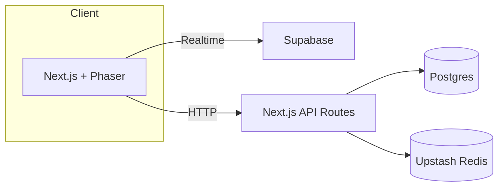

# PhotonPong

Modern Pong built with Next.js, Phaser 3, and a serverless stack.

## Setup

```bash
pnpm install
pnpm prisma migrate dev
pnpm dev
```

Copy `.env.example` to `.env.local` and fill in secrets.

### Environment variables

Set the following environment variables for the application:

- `DATABASE_URL` – Postgres connection string
- `NEXTAUTH_URL` – Base URL for NextAuth callbacks
- `EMAIL_SERVER` – SMTP server connection string
- `EMAIL_FROM` – Sender email address
- `GITHUB_ID` – GitHub OAuth client ID
- `GITHUB_SECRET` – GitHub OAuth client secret
- `AUTH_SECRET` – NextAuth secret
- `UPSTASH_REDIS_URL` – Upstash Redis REST URL
- `UPSTASH_REDIS_TOKEN` – Upstash Redis REST token

Optional variables:

- `NEXT_PUBLIC_POSTHOG_KEY` – PostHog client key
- `NEXT_PUBLIC_POSTHOG_HOST` – PostHog host URL
- `MATCHMAKING_QUEUE_TTL_SECONDS` – TTL in seconds for the matchmaking queue (default 60)

Use these names when setting deployment secrets.

### Continuous Integration environment

The GitHub Actions workflow loads a `.env.ci` file with safe placeholder
values before running linting, type checks, unit tests, and end-to-end tests.
If you add or change environment variables in `src/lib/env.ts`, update
`.env.ci` so CI runs continue to succeed.

## Architecture Overview



## Background jobs

When a match score is reported, a message is published to the `leaderboard:recalc`
Redis channel. A separate worker can subscribe to this channel and rebuild the
leaderboard asynchronously.

## Offline Testing

The Playwright suite includes an automated offline test:

```bash
pnpm e2e --browser=chromium
```

It launches the app, waits for the service worker to register, disables
network access, and ensures the `GameCanvas` continues animating.

To verify manually:

1. Run `pnpm dev` and open the app in your browser.
2. In DevTools, confirm the service worker is registered under **Application → Service Workers**.
3. Switch the Network panel to **Offline** and reload the page.
4. The app should load using cached assets even without a network connection.

## Troubleshooting

- Ensure Postgres database is reachable via `DATABASE_URL`.
- Run `pnpm prisma migrate dev` after changing the schema.
- If Playwright tests fail, install browsers with `npx playwright install`.
