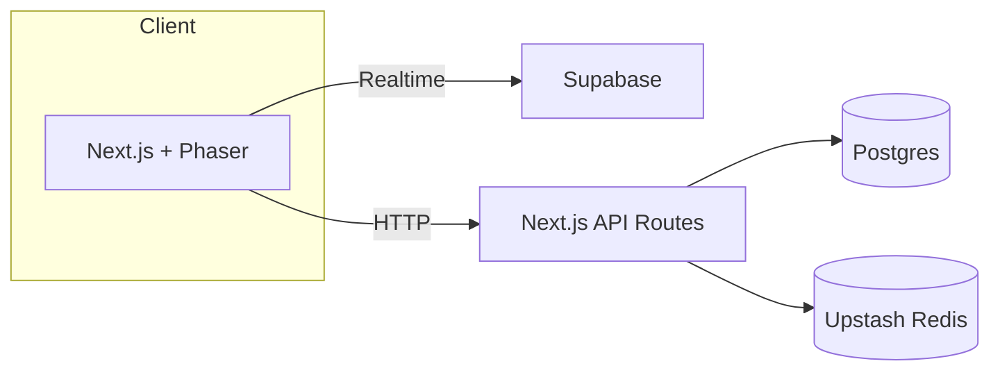

# PhotonPong

Modern Pong built with Next.js, Phaser 3, and a serverless stack.

## Setup

```bash
pnpm install
pnpm prisma migrate dev
pnpm dev
```

Copy `.env.example` to `.env.local` and fill in secrets.
Use the `UPSTASH_REDIS_URL` and `UPSTASH_REDIS_TOKEN` variables for Upstash Redis and update your deployment secrets to match.

## Architecture Overview



## Troubleshooting

- Ensure Postgres database is reachable via `DATABASE_URL`.
- Run `pnpm prisma migrate dev` after changing the schema.
- If Playwright tests fail, install browsers with `npx playwright install`.
- Internationalization: currently only English is provided; add more locales under `src/locales/` as needed.
