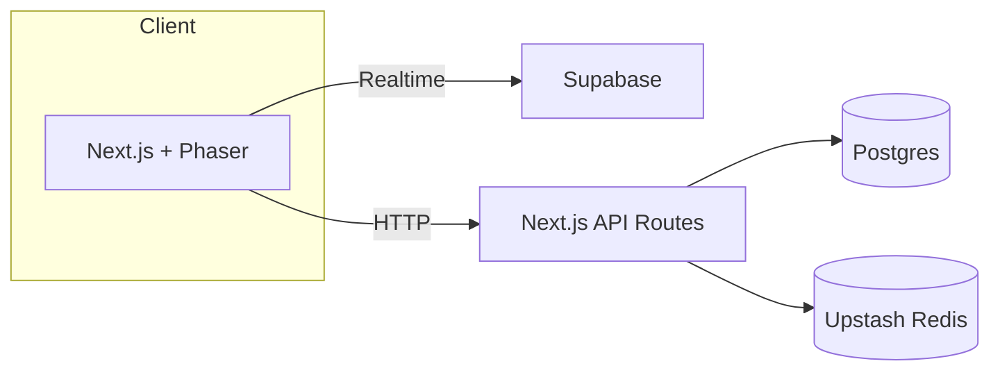

# PhotonPong

Modern Pong built with Next.js, Phaser 3, and a serverless stack.

## Setup

```bash
pnpm install
pnpm prisma migrate dev
pnpm dev
```

Copy `.env.example` to `.env.local` and fill in secrets.

## Internationalization

Translations are powered by [next-intl](https://github.com/amannn/next-intl).
To add a new language:

1. Create `src/locales/<locale>.json` with your strings.
2. Add the locale to `next.config.ts` and `src/i18n.ts`.
3. Use `useTranslations` in components: `const t = useTranslations(); t('title')`.

## Architecture Overview



## Troubleshooting

- Ensure Postgres database is reachable via `DATABASE_URL`.
- Run `pnpm prisma migrate dev` after changing the schema.
- If Playwright tests fail, install browsers with `npx playwright install`.
