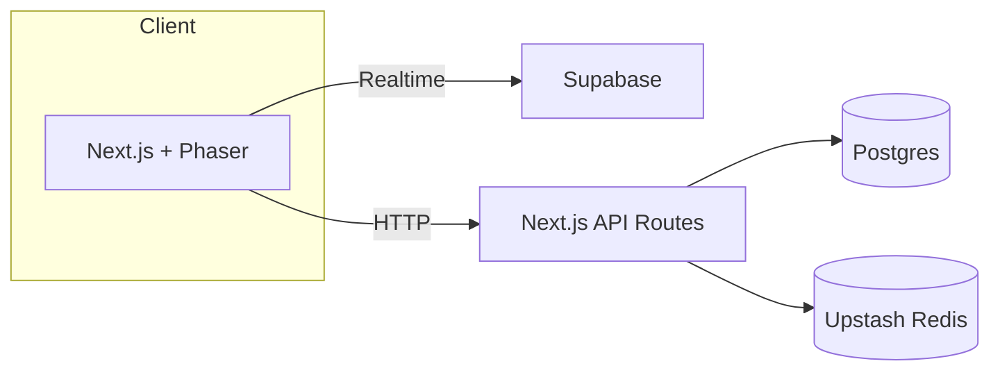

# PhotonPong

Modern Pong built with Next.js, Phaser 3, and a serverless stack.

## Setup

```bash
pnpm install
pnpm prisma migrate dev
pnpm dev
```

Copy `.env.example` to `.env.local` and fill in secrets.

### Environment Variables

The application expects the following environment variables in `.env.local`:

- `DATABASE_URL` – connection string for the Postgres database.
- `AUTH_SECRET` – secret used by NextAuth.
- `EMAIL_SERVER` – SMTP connection string for outgoing mail.
- `EMAIL_FROM` – email address used as the sender.
- `GITHUB_ID` / `GITHUB_SECRET` – GitHub OAuth credentials.
- `GOOGLE_ID` / `GOOGLE_SECRET` – Google OAuth credentials.
- `UPSTASH_REDIS_URL` / `UPSTASH_REDIS_TOKEN` – Upstash Redis credentials.
- `NEXT_PUBLIC_POSTHOG_KEY` – PostHog API key.
- `NEXT_PUBLIC_POSTHOG_HOST` – PostHog API host.
- `SUPABASE_URL` / `SUPABASE_KEY` – Supabase project credentials.
- `NEXTAUTH_URL` – canonical URL of your site for NextAuth callbacks.

## Architecture Overview



## Troubleshooting

- Ensure Postgres database is reachable via `DATABASE_URL`.
- Run `pnpm prisma migrate dev` after changing the schema.
- If Playwright tests fail, install browsers with `npx playwright install`.
- Internationalization: currently only English is provided; add more locales under `src/locales/` as needed.
